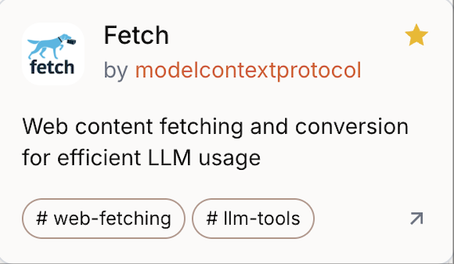
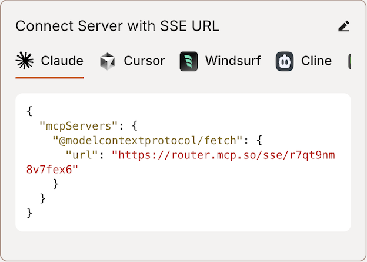
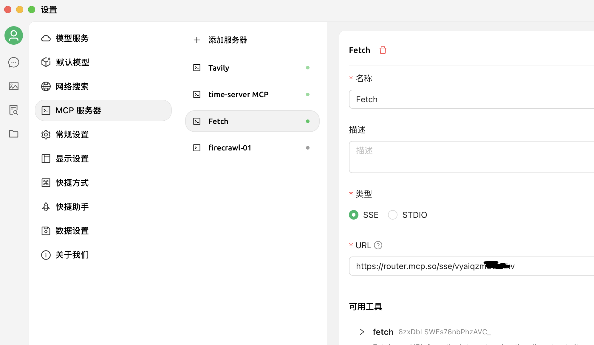
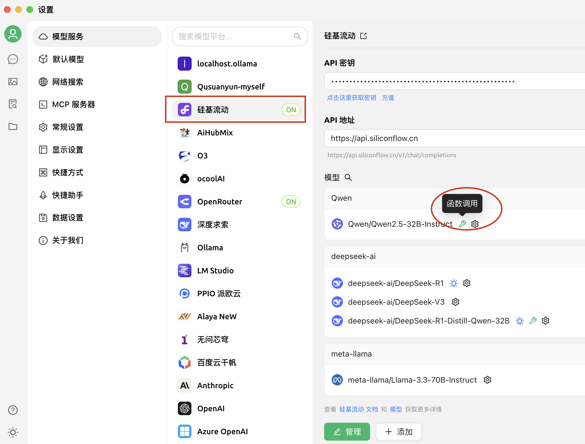
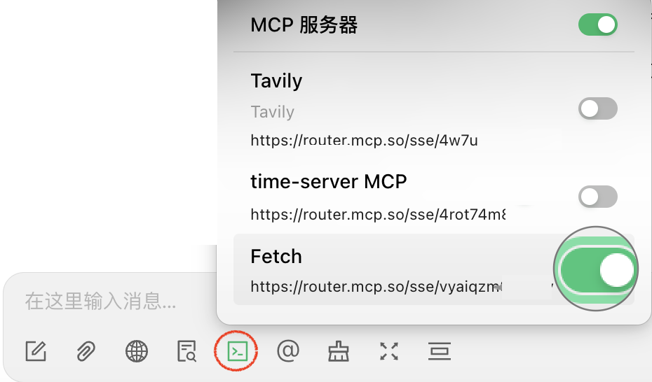

### Cherry Studio 的MCP 设置方法：

1. 打开 https://mcp.so/
2. 选择 Fetch

右边点“Connect”， 记下红色的URL 地址

3. 在Cherry Studio 中新建“MCP 服务器”， 类型选择“SSE”（也就是远程连接的意思），填入URL，保存。
   

4. 打开“模型服务”，选择一个合适的模型平台和模型（例如， 选择“硅基流动”和Qwen/Qwen2.5-32B-Instruct 这个模型），注意，模型必须是能支持函数调用的模型。

5. 在Charry Studio 中新建对话， 选择AI 模型， 在下面的选项对话中选择刚才的“Fetch” MCP 服务器。

问AI 一个最新的话题，例如让它去获取当天网站的内容：

