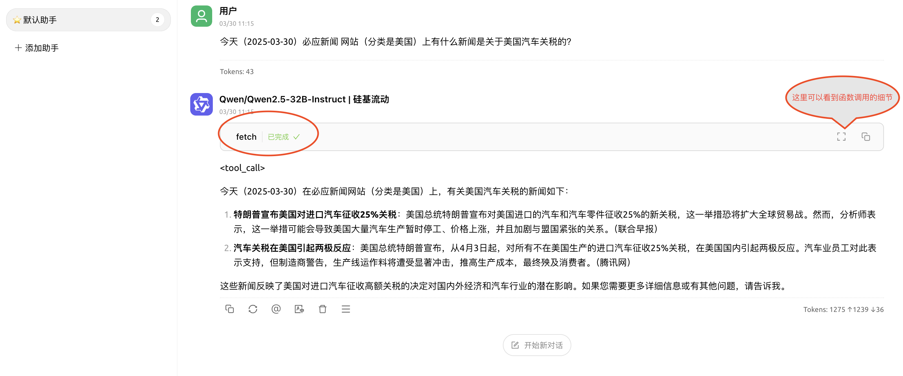

### Cherry Studio 的MCP 设置方法：

#### 1. 打开 https://mcp.so/

#### 2. 以下以“Fetch”（抓取网页内容）为例：

选择 Fetch

右边点“Connect”， 记下红色的URL 地址。

#### 3. 在Cherry Studio 的“设置”中，新建“MCP 服务器， 类型选择“SSE”（也就是远程连接的意思），填入上一步拿到的URL，点击“保存”。
   

#### 4. 在“设置”中打开“模型服务”，选择一个合适的模型平台和模型（例如， 选择“硅基流动”和Qwen/Qwen2.5-32B-Instruct 这个模型），注意，模型必须是能支持函数调用的模型（有一个绿色🔧的标志）。

#### 5. Charry Studio 中新建对话， 选择上一步的模型平台和AI 模型， 在下面的选项对话中打开刚才的“Fetch” MCP 服务器。

尝试问AI 一个最新的话题，例如让它去获取当天网站的内容，这个时候你会看到模型已经实时调用“Fetch” MCP 服务； 你可以点击右边的图标看调用的细节。

